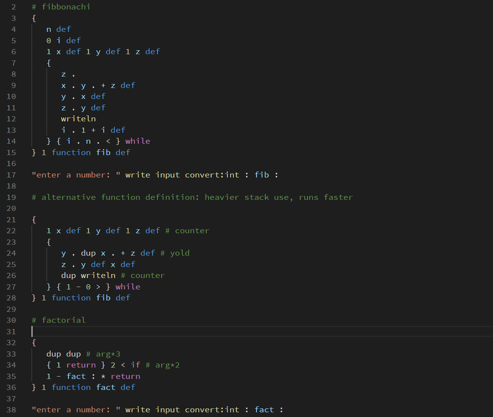
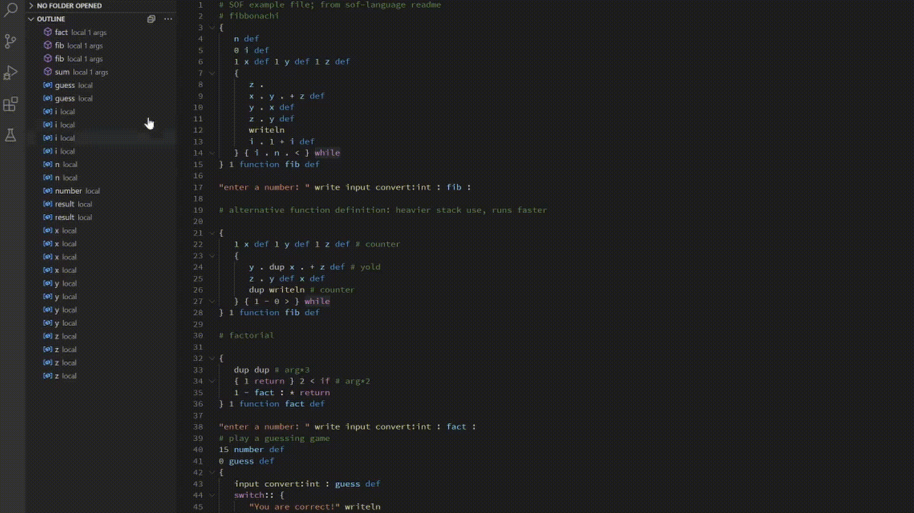

# SOF language support

A small Visual Studio Code extension that defines syntax highlighting grammar for the SOF programming language. The language itself is an open-source project by kleinesfilmröllchen and [can be found here](https://github.com/kleinesfilmroellchen/sof-language). Contributions to both the language and this syntax highlighter are welcome.

This package is licensed under MIT. A different license applies to the SOF language and its interpreter.

## New Features

The language extension now supports primitive symbol markup for functions and variable `def`s and `globaldef`s.

## Features

This extension enables syntax highlighting on ".sof" and ".stackof" files, the Stack with Objects and Functions (SOF) programming language source code. Because the language itself is reasonably simple, syntax highlighting itself is simple as well.

## Requirements

This extension requires no other extensions or applications.

## Extension Settings

This extension contributes no settings.

## Known Issues

None.

## Release Notes

See the changelog.